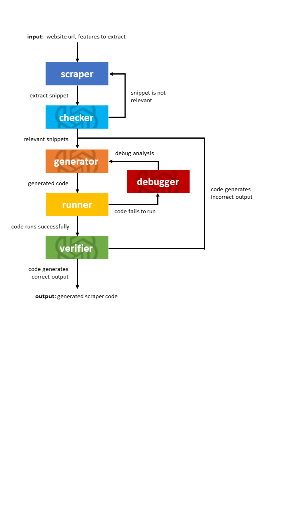

<a name="#readme-top"></a>
<h3 align="center" id="title">“I’m too lazy to write my own webscraper”: Exploring self-supervised webscraper code generation with LLMs</h3>

  <p>
    An exploratory project focused on developing a self-supervised web scraping tool using Large Language Models.
  </p>

  <p>
    By: <b>SOON</b> Kang Le, Conrad,
        Filbert <b>PHANG</b>, <b>WEE</b> Yen Zhe, Alson <b>JIANG</b>, Arnav <b>AGGARWAL</b>
  </p>

<!-- TABLE OF CONTENTS -->
<details>
  <summary>Table of Contents</summary>
  <ol>
    <li>
      <a href="#about-the-project">About The Project</a>
    </li>
    <li>
      <a href="#getting-started">Getting Started</a>
      <ul>
        <li><a href="#prerequisites">Prerequisites</a></li>
        <li><a href="#installation">Installation</a></li>
      </ul>
    </li>
    <li><a href="#usage">Usage</a></li>
    <li><a href="#roadmap">Roadmap</a></li>
    <li><a href="#contact">Contact</a></li>
    <li><a href="#acknowledgments">Acknowledgments</a></li>
  </ol>
</details>


<!-- ABOUT THE PROJECT -->
## About The Project
[Poster](https://docs.google.com/presentation/d/1tmIHLBZLKQUIQimMbzAJl9XoxlcPHSVDGLLvd_nynSU/edit#slide=id.g25df3f774b_0_170).

The adoption of Large Language Models (LLMs) has significantly accelerated the coding process, although it still requires
significant human involvement for running, verifying, and debugging. This project explores the potential of LLMs to
autonomously supervise the code generation process, particularly for creating website scrapers. The successful
proof-of-concept demonstrates that LLMs can independently oversee the development of web scrapers, suggesting their
capability as a fully automated tool for generalized scraping.



**Figure 1** - Diagram of Project

This project was done in fulfillment of the project portion for 2023/2024 iteration of CS6101 (Exploration of Computer Science Research), where
the topic was on **Large Language Models**.


<!-- GETTING STARTED -->
## Getting Started

To get a local copy up and running, follow these steps.

### Prerequisites
* Python 3.11
* OpenAI API Key

### Installation
1. Sign up for a OpenAI account [here](https://platform.openai.com/signup)
2. Visit the API [page](https://platform.openai.com/api-keys) to get an API Key. Note that API keys are only viewable once.
4. Clone the repo
   ```sh
   git clone https://github.com/cs6101-t2310-rc5/gptScraper
   ```
4. Install necessary packages for the project
   ```sh
   pip install requirements.txt
   ```

[🔼 Back to top](#title)


<!-- USAGE EXAMPLES -->
## Usage
   ```bash
   OPENAI_API_KEY="XXXXX" python agents_instruct.py <path_to_dataset_json> <dataset_name>
   ```
- *path_to_dataset_json* refers to the path of the relevant dataset json files. Current ones are
1) ../data/arxiv.json
2) ../data/leverco.json
3) ../data/lverco_full.json
- *dataset_name* refers to the desired folder to store the results and generated code, if any. The current folders in the
project currently include
1. arxiv_data
2. leverco
3. leverco_old_run
4. leverco_shortened


<!-- ROADMAP -->
## Roadmap

- [x] Model is able to generates code
- [x] Model is able to generate code to scrape from static websites
- [ ] Model is able to generate code to scrape from dynamic websites
- [ ] Front-end wrapper (through Huggingface Spaces) for this project

[🔼 Back to top](#title)


<!-- CONTACT -->
## Contact
- Filbert **Phang** [filbert.phang@u.nus.edu](filbert.phang@u.nus.edu)
- Conrad **Soon** [conrad.soon@u.nus.edu](conrad.soon@u.nus.edu)
- Yen Zhe **Wee** [@reallytheren0w](https://twitter.com/reallytheren0w)
- Alson **Jiang** [alson@u.nus.edu](alson@u.nus.edu)
- Arnav **Aggarwal** [@Arnav_Agg](https://twitter.com/Arnav_Agg)

Project Link: [https://github.com/cs6101-t2310-rc5/gptScraper](https://github.com/cs6101-t2310-rc5/gptScraper)

[🔼 Back to top](#title)

<!-- ACKNOWLEDGMENTS -->
## Acknowledgments

* A/P [Min-Yen Kan](https://www.comp.nus.edu.sg/~kanmy/), for providing us with the opportunity to do up a project of our interest for course credit
* [NUS Web Information Retrieval / Natural Language Processing Group (WING)](https://wing.comp.nus.edu.sg/), for the support in the course
* You, for reading through this readme.md

[🔼 Back to top](#title)